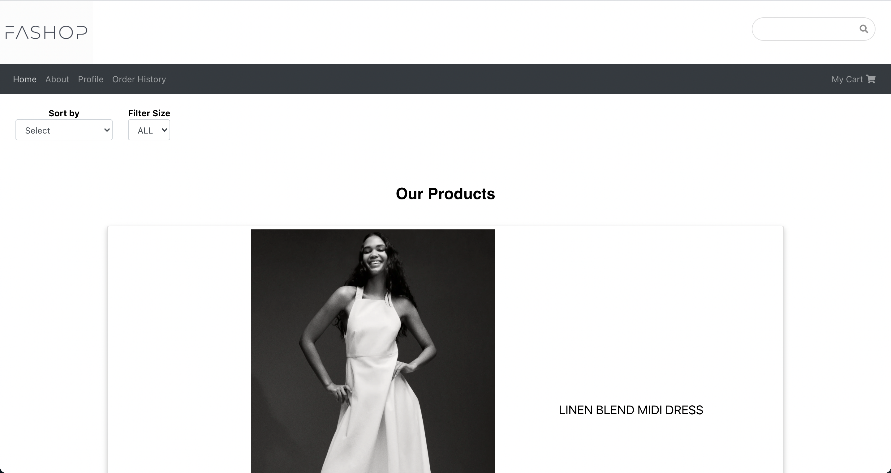

<!-- PROJECT LOGO -->

<br />
<p align="center">
  <a href="https://github.com/misswonder/Fashop-frontend">
    
  </a>

  <h3 align="center">Fashop</h3>

  <p align="center">
    OUR MISSION: An e-commerce clothing application that allows users to browse and purchase in season clothing styles. 
    <br />
    <br />
    <a href="https://www.youtube.com/watch?v=QuEI20XRdAA&t=11s">View Demo</a>
  </p>
</p>

<!-- TABLE OF CONTENTS -->
<details open="open">
  <summary>Table of Contents</summary>
  <ol>
    <li>
      <a href="#about-the-project">About The Project</a>
      <ul>
        <li><a href="#built-with">Built With</a></li>
      </ul>
    </li>
    <li>
      <a href="#installation">Installation</a>
    </li>
    <li><a href="#contact">Contact</a></li>
  </ol>
</details>

<!-- ABOUT THE PROJECT -->

## About The Project



Capstone project for Software Engineering at Flatiron School. Fashop is a full-stack web application that allows users to browse and purchase on latest trending clothes. Users can signup an account, browse and purchase any selected products in their choices. 

Key Features:

- Desktop app
- User authentication
- Option to browse all the clothes and purchase any selected items
- Explore clothes with abilities of sorting by prices and filtering by sizes
- Search a specific category of clothes
- View purchased clothes in users' shopping carts
- Displays all the order histories related to an individual user

### Built With

- [React](https://reactjs.org/)
- [Redux](https://redux.js.org/)
- [React Bootstrap](https://react-bootstrap.github.io/)
- [React Semantic UI](https://react.semantic-ui.com/)

### Installation

1. Clone the repo
   ```sh
   git clone git@github.com:misswonder/Fashop-frontend.git
   ```
2. Install NPM packages
   ```sh
   npm install
   ```
3. Start the React app
   ```sh
   npm start (defaulted port: http://localhost:3000)
   ```
<!-- CONTACT -->

## Contact

Project Link: [https://github.com/misswonder/Fashop-frontend](https://github.com/misswonder/Fashop-frontend)   

